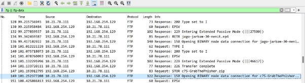
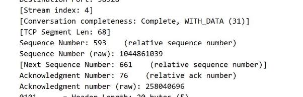
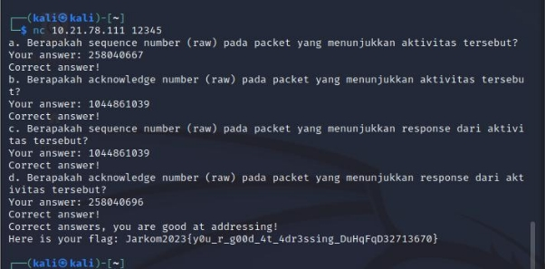
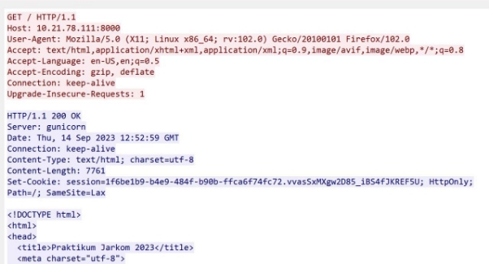
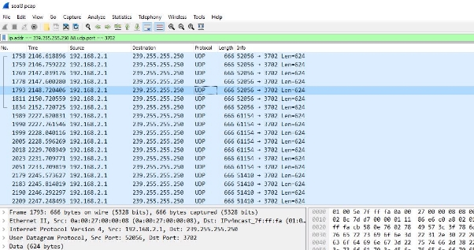
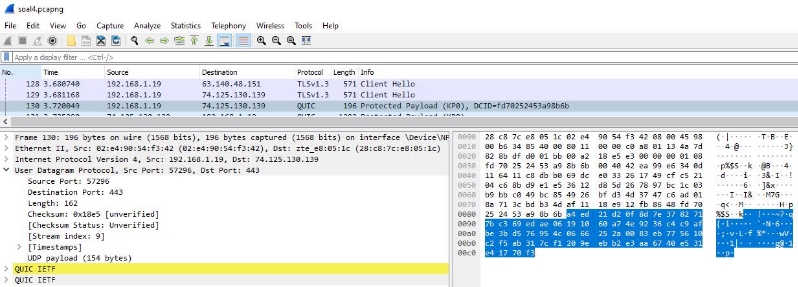
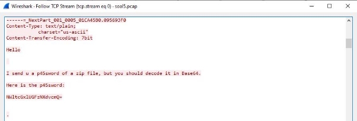
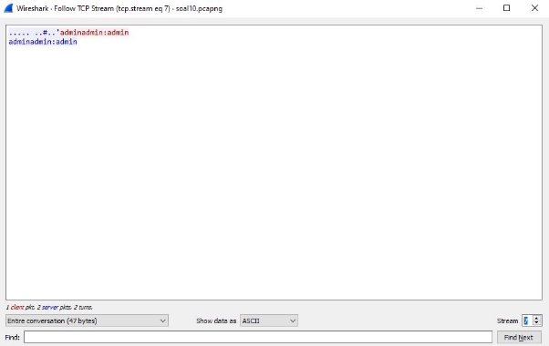
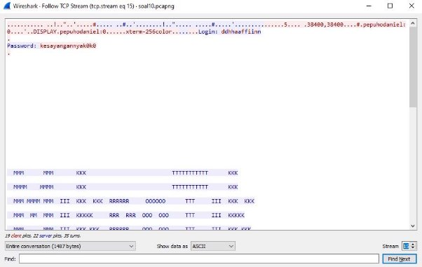

LAPORAN RESMI PRAKTIKUM JARKOM 1

Nama :

- Fina Keiza Arismana 5027211028
- Rifqi Ahmad Maulana 5027211035

**SOAL 1**
Soal.
nc 10.21.78.111 12345

User melakukan berbagai aktivitas dengan menggunakan protokol FTP. Salah satunya adalah mengunggah suatu file. Kemudian praktikan disuruh mencari sequence number (raw) dan acknowledge (raw) yang menunjukan aktivitas dan response. 

Cara Mengerjakan.
1. Melakukan filtering menggunakan **ftp || ftp-data** karena menggunakan protokol ftp dan sedang berjalan di dalam server
2. Kemudian cari tulisan **REQUEST STOR** pada seluruh info, gunanya untuk mencari yang sedang dalam keadaan mengunggah file
3. Kemudian lakukan klik 2 kali untuk membuka

4. Kemudian akan menemukan seq number (raw) dan juga ack number (raw)
5. Untuk pertanyaan response berada dibawahnya

Kendala.
Tidak ada 

**SOAL 2**
Soal. 
nc 10.21.78.111 13579

Praktikan disuruh menyebutkan web server yang digunakan pada portal praktikum jaringan komputer. 

Cara Mengerjakan.
1. Mencari HTTP pada filter diatas
2. Kemudian mencari tulisan HTTP GET
3. Kemudian klik kanan dan lakukan follow TCP ataupun HTTP
4. Klik 2 kali kemudian cari tulisan server
5. Akan ditemukan **server : gunicorn**

Kemudian buka linux, kemudian masukan command **nc** kemudian masukan jawaban dan nanti akan menemukan flag.

Kendala.
Tidak ada 

**SOAL 3**
Soal.
nc 10.21.78.111 13590

Praktikan diberikan 2 pertanyaan:

1. Berapa banyak paket yang tercapture dengan IP source maupun destination address adalah 239.255.255.250 dengan port 3702?
1. Protokol layer transport apa yang digunakan?

Cara Mengerjakan.
Dapat dilakukan filter dengan display filter sebagai berikut: “**ip.addr == 239.255.255.250**”

Terlihat bahwa yang menuju port 3702 hanya yang ber protokol UDP, maka display filter dapat ditambahkan dengan “**udp.port == 3702**” sehingga terlihat seperti berikut: “**ip.addr == 239.255.255.250 && udp.port == 3702**”

Karena semua yang ber-port 3702 ber protokol UDP dan berjumlah 21, maka didapatkan flag sebagai berikut

Kendala.
Tidak ada 

**SOAL 4**
Soal.
nc 10.21.78.111 13591

Berapa nilai checksum yang didapat dari header pada paket nomor 130?

Cara Mengerjakan.
Praktikan diberikan file soal4.pcapng, lalu diarahkan menuju packet nomor 130 untuk mencari nilai checksum yang didapat di header packet tersebut.

Menuju ke packet nomor 130 dari file soal4.pcapng, kita lihat detailnya melalui wireshark, pada section User Diagram Protocol > Checksum, terlihat string checksum nya adalah “0x18e5”.

Berikut adalah pertanyaan dan jawaban yang disubmit:

Kendala.
Tidak ada 

**SOAL 5**
Soal.
nc 10.21.78.111 11111

Praktikan diberikan persoalan untuk analisis file packet yang “menarik” untuk menemukan password dari .zip file (zippppfileee.zip) yang ter-attach pada modal soal.

Cara Mengerjakan.
Dalam file soal5.pcap yang berisi 60 packet, dapat dilakukan follow TCP untuk packet TCP pertama yang ditemui.

Dari hasil decode base64 “NWltcGxlUGFzNXdvcmQ=”, didapatkan plaintext “5implePas5word”, yang dapat digunakan untuk membuka isi file connect.txt dari .zip yang ter-attach.

Diberikan instruksi untuk nc ke ip yang tertera, setelahnya akan menemui beberapa pertanyaan tambahan sebelum mendapatkan flag.

1. Berapa banyak packet yang berhasil di capture dari file pcap tersebut?

Dalam file soal5.pcap terdapat total **60** packets dan server

2. Port berapakah pada server yang digunakan untuk service SMTP?

Melihat dari potongan file soal5.pcap berikut:

Terlihat bahwa ip yang mengirimkan response terhadap request smtp dari ip eksternal adalah 74.53.140.153, dan source port adalah **25**

3. Dari semua alamat IP yang tercapture, IP berapakah yang merupakan public IP?

Public ip yang diketahui adalah yang memiliki awalan selain 192., 10., dan 172.. Yang memenuhi kriteria adalah **74.53.140.153**

Kendala.
Tidak ada 

**SOAL 6**
Soal.
Praktikan harus menemukan solusi kode error "server SOURCE ADDRESS 7812 is invalid"

Cara Mengerjakan.
-

Kendala. 
- Kurang adanya clue
- Waktu yang tidak mencukupi, mengingat adanya perubahan saat waktu kurang dari 1 jam  pengerjaan

**SOAL 7**
Soal.
nc 10.21.78.111 6565

Praktikan diberikan pertanyaan:

- Berapa jumlah packet yang menuju IP 184.87.193.88

Cara Mengerjakan.
Untuk mendapatkan hasil yang diinginkan dapat dilakukan display filter sebagai berikut:

Diketahui bahwa jumlah packet berjumlah 6. Setelahnya dapat diinputkan jawaban via nc dan didapatkan flag sebagai berikut:

Kendala.
Tidak ada 

**SOAL 8**
Soal.
Praktikan diberi kueri filter kemudian disuruh mengambil semua protokol paket yang menuju port 80.
nc 10.21.78.111 7171

Cara Mengerjakan.
Untuk menjawab menggunakan kueri filter, **tcp.dstport == 80 || udp.dstport == 80**. Fungsi-fungsinya adalah dst digunakan untuk memfilter paket berdasarkan alamat IP yang dituju, tcp.dstport == 80 untuk mencari paket yg menggunakan protokol **TCP** dengan port tujuan 80), udp.dstport == 80 untuk mencari paket yg menggunakan protokol **UDP** dengan port tujuan 80), **||** merupakan operator OR untuk memenuhi salah satu kondisi tersebut.

Kendala.
Tidak ada 

**SOAL 9**
Soal.
nc 10.21.78.111 7272

Praktikan diberi pertanyaan:

Berikan kueri filter sehingga wireshark hanya mengambil paket yang berasal dari alamat 10.51.40.1 tetapi tidak menuju ke alamat 10.39.55.34!

Cara Mengerjakan.
Untuk mendapatkan hasil yang diperintahkan, bisa dilakukan dengan display filter sebagai berikut:

ip.src == 10.51.40.1 && ip.dst != 10.39.55.34 Input query di atas via nc dan didapatkan flag:

Kendala.
Tidak ada 

**SOAL 10**
Soal.
nc 10.21.78.111 7373

Praktikan diberikan pertanyaan sebagai berikut:

- Sebutkan kredensial yang benar ketika user mencoba login menggunakan Telnet, format [username]:[password]

Cara Mengerjakan.
Pertama, karena menggunakan protokol **Telnet**, maka dapat dilakukan filter dengan memasukkan “telnet” ke field display filter.

Tampak bahwa semua attempt login adalah dari ip 172.16.0.254 menuju ke 172.16.0.4. Selanjutnya, dilakukan filter: “telnet && ip.dst == 172.16.0.4”, didapatkan list packet sbb:

Follow TCP streamnya, tepat pada stream ke 15, terlihat response yang sedikit berbeda dari yang lain seperti berikut:

Packet 7 (representasi packet lain, 1-14):

Packet 15:

Jika disusun kembali, didapatkan username dan password yang benar adalah dhafin:kesayangannyak0k0

Kendala.
Tidak ada 

